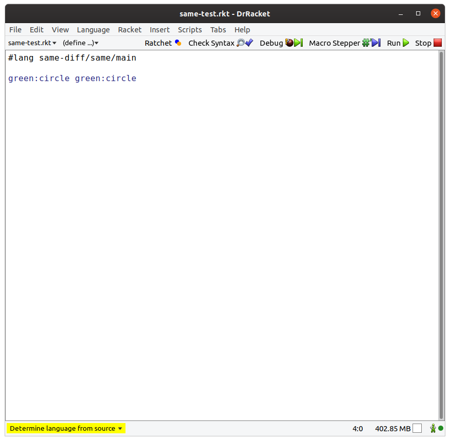
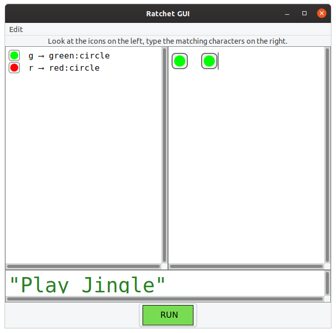
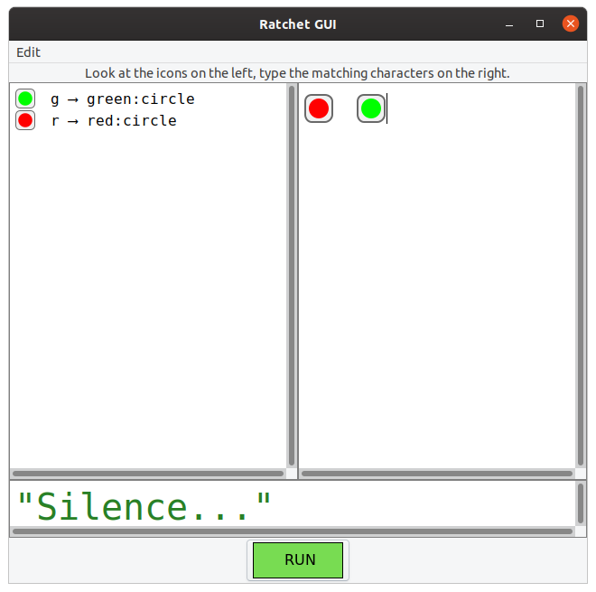
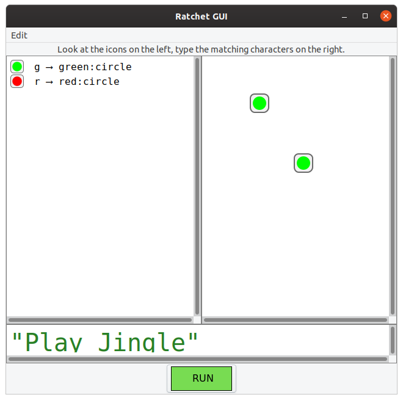
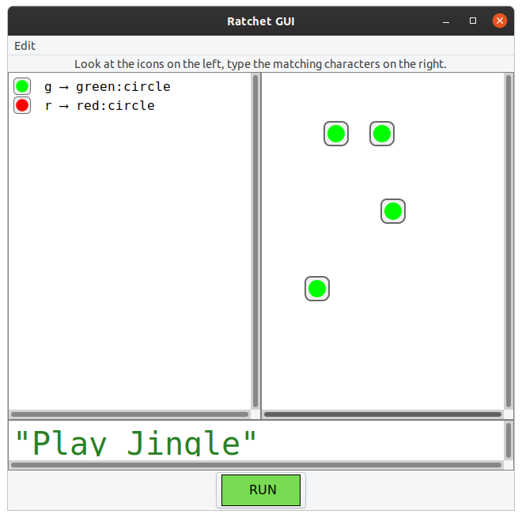
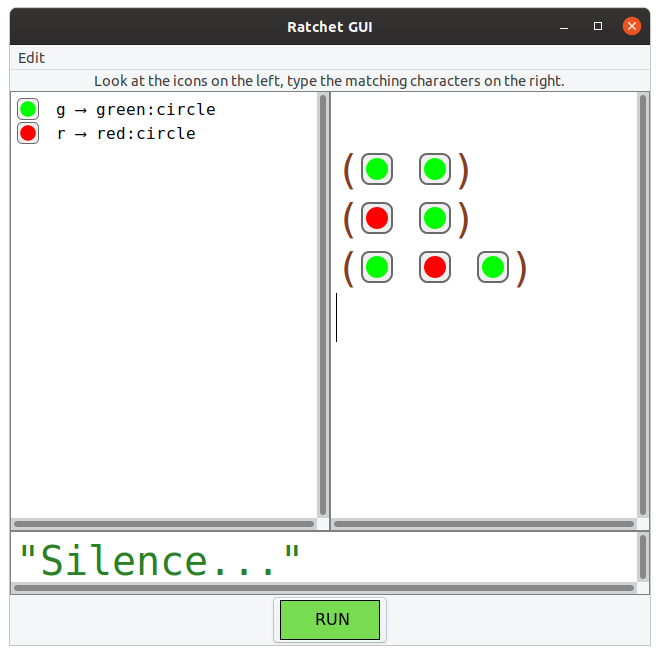
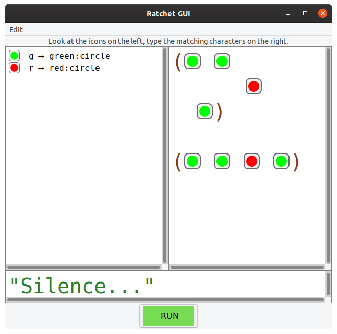
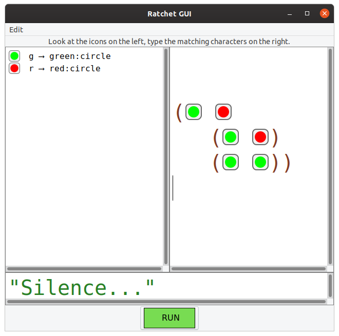

# Psychology + Programming Lanuages 

## Installation

First, install Racket on your system.  Verify that the command line tools were set up properly.  You should be able to do something like this:

```
> racket -v
Welcome to Racket v7.*.
```

Now, you can install packages contained in this repo.  Currently, there is only one -- an incomplete translation of the experimental setup described in Carstensen, et al paper (["Context Shapes Early Diversity in Abstract Thought"](https://ucsdnews.ucsd.edu/pressrelease/culture_shapes_how_we_learn_to_reason)) into two programming langauges:

1) One that plays jingles when shapes are the same,
2) One that plays jingles when shapes are different

```
git clone git@github.com:srfoster/psychology-and-coding.git
cd psychology-and-coding/same-diff
raco pkg install
```

This will install things and fetch dependencies.   When it finishes, you should be able to run some of the tests:

```
> racket tests/same-test.rkt
"Play Jingle"
```

(Note: I didn't add real audio, since I figure that would be a fun project for undergrads.)

```
> racket tests/diff-test.rkt
"Silence..."
```

If you open the test files in DrRacket (which should also be installed on your computer), you'll see that each file contains a short program written in a differently named language:

One looks like:

```
#lang same-diff/same/main

green:circle green:circle
```

The other looks like:

```
#lang same-diff/diff/main

green:circle green:circle
```

In DrRacket, you can play with these files.  For example, you could change `diff-test.rkt` to:

```
#lang same-diff/diff/main

green:circle red:circle
```

If you run this in DrRacket, you should get `"Play Jingle"` instead of `"Silence..."` -- because the shapes are different now.

(Note: The only shapes I implemented are `red:circle` and `green:circle`, since I figured adding more might be a nice project for undergrads.)

You'll also notice that there's a Ratchet button on the menu bar, letting you pop open a graphical programming window, so you can experiment with the graphical versions of the various languages.  ("Ratchet" is a combo of Scratch and Racket -- because it adds a graphical syntax layer on top of what would otherwise be a textual programming language.)

See the Ratchet button in the screenshot below?



If you pop open the Ratchet window from a file written in `#lang same-diff/same/main` and insert two shapes that are the same, you'll get a jingle (just like in the textual version of the code).



Or if you insert a non-same shape, you'll get silence:



Already, there are some interesting (at least to me) questions.  Like, at what age does it become possible for people to abstract over "whitespace" -- recognizing that the program below will also play a jingle?



Another question -- does the same/difference reasoning extend to more than two shapes?



You may also notice that I implemented this simple graphical language without parentheses (i.e. a grouping mechanism).  But adding grouping immediately allows for syntactically more complex programs, which allows for new questions about reasoning.  For example: Would people who understand the semantics of the languages above see the program below and be able to predict that it will play one measure of jingle and two measures of silence?  (Note: It will currently throw an error.)



At what age are people able to see that the two expressions in the image below are equivalent?  (That is, they are able to comprehend the syntactic grouping while also abstracting out the whitespace?)



And a final evolution (from a purely syntactical point of view) would be nested expressions.

Here's a nonsense program simply to illustrate the general idea (it would throw an error if you ran it).



For examples of nested expressions that actually do something, see [some of our teaching languages](https://katas.thoughtstem.com/K2/ts-k2-clicker-cartoon-asp-2020/doc/manual/Collect_Katas.html#%28part._.Clicker_.Collect_001_.Kata%29).

In general, though, I've tried to implement the `same-diff` languages as very simple things.  I think there are cool questions to be asked at the simplest of levels -- as well as a lot of potential at each subsequent level of language complexity.

## Possible next steps

* Finish translating the Carstensen, et al semantics.
  - Add an actual auditory jingle
  - Add additional shapes
* Create other languages that help ask other interesting questions at the intersection of abstract reasoning and syntactic reasoning.

## Possible research questions

All of the questions that jump out to me are ones that attempt to tease out the relationships between reasoning on syntax and reasoning in general.  A general strategy is: Find questions about reasoning that can be encoded as questions about syntax and semantics.

* What other analogical reasoning questions can be translated into questions about programming language comprehension?
* Can all questions be translated in such a way?
* Are the experimental results always the same?

